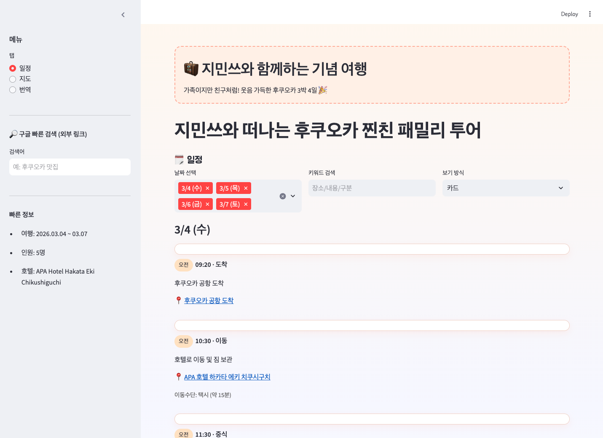

# 지민쓰와 떠나는 후쿠오카 찐친 패밀리 투어

가족이지만 친구처럼! 5인 전용 후쿠오카 여행 일정 앱 (Streamlit)

## 주요 기능
- 날짜별 일정 카드/표 조회
- 일정 편집 및 자동 저장 (재실행 시 유지)
- 장소 클릭 시 Google 지도 연결 + 지도 탭에서 장소 보기
- 한국어 ↔ 일본어 번역 (OpenAI)
- 음성 입력(STT) 및 번역 결과 음성 출력(TTS)
- 사이드바 구글 빠른 검색(외부 링크)

## 로컬 실행
```bash
python3 -m venv .venv
source .venv/bin/activate
pip install -r requirements.txt
streamlit run app.py
```

## 환경변수 (.env)
로컬 실행 시 `.env`에 아래 키를 넣어주세요.
```env
OPENAI_API_KEY=
OPENAI_MODEL=gpt-4o-mini
OPENAI_TRANSLATE_MODEL=gpt-4o-mini
OPENAI_STT_MODEL=whisper-1
OPENAI_OCR_MODEL=gpt-4o-mini
OPENAI_TTS_MODEL=gpt-4o-mini-tts
OPENAI_TTS_VOICE=alloy
GOOGLE_MAPS_API_KEY=
```

## Streamlit Community Cloud 배포
1. GitHub에 푸시
2. Streamlit Community Cloud에서 Repo 연결
3. App → Settings → **Secrets**에 아래 입력
```
OPENAI_API_KEY="..."
OPENAI_MODEL="gpt-4o"
OPENAI_STT_MODEL="whisper-1"
OPENAI_TTS_MODEL="gpt-4o-mini-tts"
OPENAI_TTS_VOICE="alloy"
GOOGLE_MAPS_API_KEY="..."
```
4. 배포 완료 후 자동 반영

## 배포 체크리스트
- [ ] `requirements.txt` 최신화
- [ ] `streamlit run app.py` 로컬 실행 확인
- [ ] `.env` 커밋되지 않았는지 확인
- [ ] Streamlit Secrets 입력 완료
- [ ] 지도/번역/음성 기능 동작 확인

## API 키 발급 링크
- Google Maps Embed API: https://developers.google.com/maps/documentation/embed/quickstart
- Google Cloud Console (API 키 생성/관리): https://console.cloud.google.com/apis/credentials
- Streamlit Secrets 가이드: https://docs.streamlit.io/streamlit-community-cloud/deploy-your-app/secrets-management
- OpenAI API 키 발급: https://platform.openai.com/api-keys

## 스크린샷
`docs/screenshots/` 폴더에 이미지 추가 후, 아래처럼 붙여 넣어 사용하세요.



## 데이터 파일
- `data/schedule.csv` : 일정 원본 데이터
- `data/schedule.backup.csv` : 자동 백업 (git ignore)

## 일정 편집 팁
`data/schedule.csv`에 `지도검색어` 컬럼을 채우면 지도 링크가 더 정확해집니다.  
예: `나카가와 세이류 온천`, `텐진 지하상가` 등

## 참고
- Google Maps Embed API는 **키 + 결제 계정 연결**이 필요합니다.
- 번역/음성은 OpenAI API 사용량에 따라 과금됩니다.
